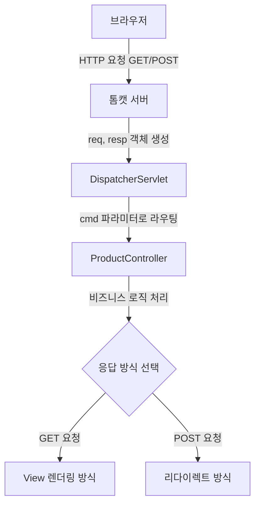
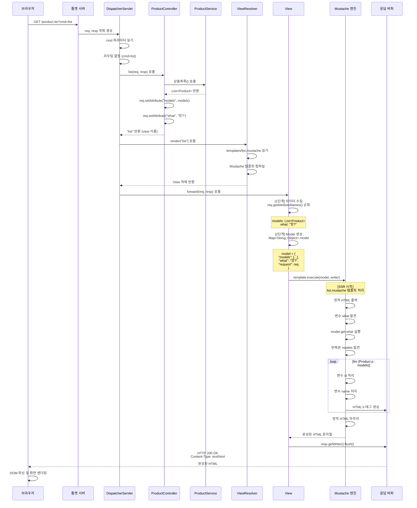
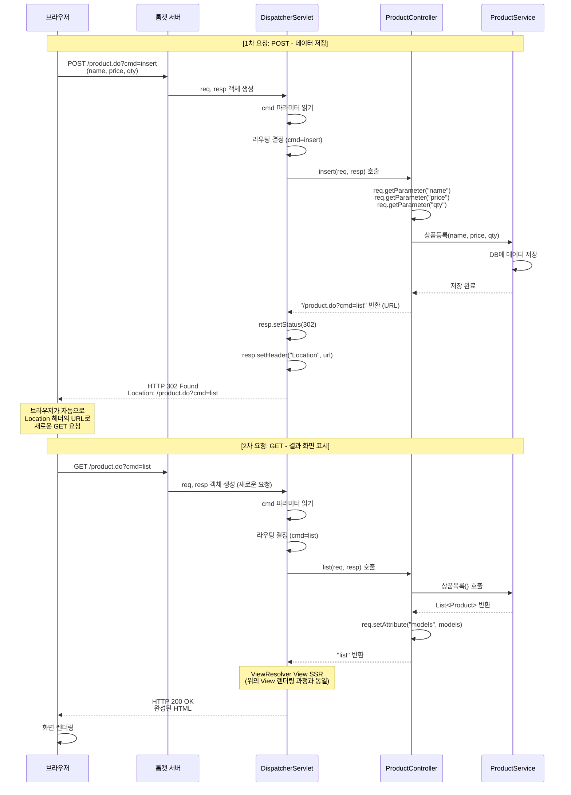
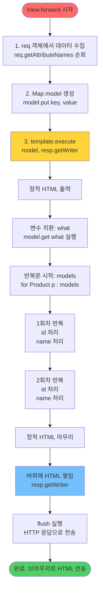
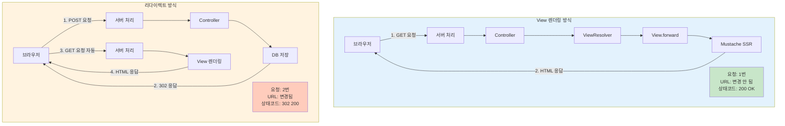

# 다이어그램 모음

## 1. 전체 요청-응답 흐름

```mermaid
graph TD
    A[브라우저] -->|HTTP 요청 GET/POST| B[톰캣 서버]
    B -->|req, resp 객체 생성| C[DispatcherServlet]
    C -->|cmd 파라미터로 라우팅| D[ProductController]
    D -->|비즈니스 로직 처리| E{응답 방식 선택}
    E -->|GET 요청| F[View 렌더링 방식]
    E -->|POST 요청| G[리다이렉트 방식]
```

## 2. View 렌더링 방식 (SSR) - 시퀀스 다이어그램

```mermaid
sequenceDiagram
    participant Browser as 브라우저
    participant Tomcat as 톰캣 서버
    participant DS as DispatcherServlet
    participant PC as ProductController
    participant PS as ProductService
    participant VR as ViewResolver
    participant View as View
    participant ME as Mustache 엔진
    participant Buffer as 응답 버퍼

    Browser->>Tomcat: GET /product.do?cmd=list
    Tomcat->>DS: req, resp 객체 생성
    
    DS->>DS: cmd 파라미터 읽기
    DS->>DS: 라우팅 결정 (cmd=list)
    DS->>PC: list(req, resp) 호출
    
    PC->>PS: 상품목록() 호출
    PS-->>PC: List<Product> 반환
    PC->>PC: req.setAttribute("models", models)
    PC->>PC: req.setAttribute("what", "엉?")
    PC-->>DS: "list" 반환 (view 이름)
    
    DS->>VR: render("list") 호출
    VR->>VR: templates/list.mustache 읽기
    VR->>VR: Mustache 템플릿 컴파일
    VR-->>DS: View 객체 반환
    
    DS->>View: forward(req, resp) 호출
    
    View->>View: [1단계] 데이터 수집<br/>req.getAttributeNames() 순회
    Note over View: models: List<Product><br/>what: "엉?"
    
    View->>View: [2단계] Model 생성<br/>Map<String, Object> model
    Note over View: model = {<br/>  "models": [...],<br/>  "what": "엉?",<br/>  "request": req<br/>}
    
    View->>ME: template.execute(model, writer)
    
    Note over ME: [SSR 시작]<br/>list.mustache 템플릿 처리
    
    ME->>ME: 정적 HTML 출력
    ME->>ME: 변수 what 발견
    ME->>ME: model.get what 실행
    ME->>ME: 반복문 models 발견
    
    loop for (Product p : models)
        ME->>ME: 변수 id 처리
        ME->>ME: 변수 name 처리
        ME->>Buffer: HTML tr 태그 생성
    end
    
    ME->>ME: 정적 HTML 마무리
    ME-->>View: 완성된 HTML 문자열
    
    View->>Buffer: resp.getWriter().flush()
    Buffer-->>Browser: HTTP 200 OK<br/>Content-Type: text/html<br/><br/>완성된 HTML
    Browser->>Browser: DOM 파싱 및 화면 렌더링
```

## 3. 리다이렉트 방식 - 시퀀스 다이어그램

```mermaid
sequenceDiagram
    participant Browser as 브라우저
    participant Tomcat as 톰캣 서버
    participant DS as DispatcherServlet
    participant PC as ProductController
    participant PS as ProductService

    Note over Browser,PS: [1차 요청: POST - 데이터 저장]
    
    Browser->>Tomcat: POST /product.do?cmd=insert<br/>(name, price, qty)
    Tomcat->>DS: req, resp 객체 생성
    
    DS->>DS: cmd 파라미터 읽기
    DS->>DS: 라우팅 결정 (cmd=insert)
    DS->>PC: insert(req, resp) 호출
    
    PC->>PC: req.getParameter("name")<br/>req.getParameter("price")<br/>req.getParameter("qty")
    PC->>PS: 상품등록(name, price, qty)
    PS->>PS: DB에 데이터 저장
    PS-->>PC: 저장 완료
    PC-->>DS: "/product.do?cmd=list" 반환 (URL)
    
    DS->>DS: resp.setStatus(302)
    DS->>DS: resp.setHeader("Location", url)
    DS-->>Browser: HTTP 302 Found<br/>Location: /product.do?cmd=list
    
    Note over Browser: 브라우저가 자동으로<br/>Location 헤더의 URL로<br/>새로운 GET 요청
    
    Note over Browser,PS: [2차 요청: GET - 결과 화면 표시]
    
    Browser->>Tomcat: GET /product.do?cmd=list
    Tomcat->>DS: req, resp 객체 생성 (새로운 요청)
    
    DS->>DS: cmd 파라미터 읽기
    DS->>DS: 라우팅 결정 (cmd=list)
    DS->>PC: list(req, resp) 호출
    
    PC->>PS: 상품목록() 호출
    PS-->>PC: List<Product> 반환
    PC->>PC: req.setAttribute("models", models)
    PC-->>DS: "list" 반환
    
    Note over DS: ViewResolver View SSR<br/>(위의 View 렌더링 과정과 동일)
    
    DS-->>Browser: HTTP 200 OK<br/>완성된 HTML
    Browser->>Browser: 화면 렌더링
```

## 4. SSR 상세 과정 - 플로우차트

```mermaid
flowchart TD
    Start([View.forward 시작]) --> Collect[1. req 객체에서 데이터 수집<br/>req.getAttributeNames 순회]
    
    Collect --> Model[2. Map model 생성<br/>model.put key, value]
    
    Model --> Execute[3. template.execute<br/>model, resp.getWriter]
    
    Execute --> Static1[정적 HTML 출력]
    
    Static1 --> Var1[변수 치환: what<br/>model.get what 실행]
    
    Var1 --> LoopStart[반복문 시작: models<br/>for Product p : models]
    
    LoopStart --> Loop1[1회차 반복<br/>id 처리<br/>name 처리]
    
    Loop1 --> Loop2[2회차 반복<br/>id 처리<br/>name 처리]
    
    Loop2 --> Static2[정적 HTML 마무리]
    
    Static2 --> Buffer[버퍼에 HTML 쌓임<br/>resp.getWriter]
    
    Buffer --> Flush[flush 실행<br/>HTTP 응답으로 전송]
    
    Flush --> End([완료: 브라우저로 HTML 전송])
    
    style Start fill:#ff6b6b
    style End fill:#51cf66
    style Execute fill:#ffd43b
    style Buffer fill:#74c0fc
```

## 5. 데이터 흐름 다이어그램

```mermaid
flowchart LR
    subgraph DB[데이터베이스]
        Data[(Product 테이블)]
    end
    
    subgraph Server[서버]
        subgraph Controller[ProductController]
            PC[list 메서드]
        end
        
        subgraph Request[req 객체]
            Attr1[models: List Product]
            Attr2[what: 엉?]
        end
        
        subgraph View[View.forward]
            Model[Map model 생성]
        end
        
        subgraph Template[Mustache 템플릿]
            Mustache[list.mustache<br/>models 반복문...]
        end
        
        subgraph Buffer2[응답 버퍼]
            HTML[완성된 HTML 문자열]
        end
    end
    
    subgraph Client[브라우저]
        Browser[화면 렌더링]
    end
    
    Data -->|DB 조회| PC
    PC -->|req.setAttribute| Request
    Request -->|req.getAttribute| Model
    Model -->|model 전달| Mustache
    Mustache -->|SSR 처리| HTML
    HTML -->|HTTP 응답| Browser
    
    style Data fill:#ff6b6b
    style HTML fill:#51cf66
    style Browser fill:#74c0fc
```

## 6. 비교 다이어그램

```mermaid
graph TB
    subgraph ViewRender[View 렌더링 방식]
        VR1[브라우저] -->|1. GET 요청| VR2[서버 처리]
        VR2 --> VR3[Controller]
        VR3 --> VR4[ViewResolver]
        VR4 --> VR5[View.forward]
        VR5 --> VR6[Mustache SSR]
        VR6 -->|2. HTML 응답| VR1
        VR7[요청: 1번<br/>URL: 변경 안 됨<br/>상태코드: 200 OK]
    end
    
    subgraph Redirect[리다이렉트 방식]
        RD1[브라우저] -->|1. POST 요청| RD2[서버 처리]
        RD2 --> RD3[Controller]
        RD3 --> RD4[DB 저장]
        RD4 -->|2. 302 응답| RD1
        RD1 -->|3. GET 요청 자동| RD5[서버 처리]
        RD5 --> RD6[View 렌더링]
        RD6 -->|4. HTML 응답| RD1
        RD7[요청: 2번<br/>URL: 변경됨<br/>상태코드: 302 200]
    end
    
    style ViewRender fill:#e3f2fd
    style Redirect fill:#fff3e0
    style VR7 fill:#c8e6c9
    style RD7 fill:#ffccbc
```